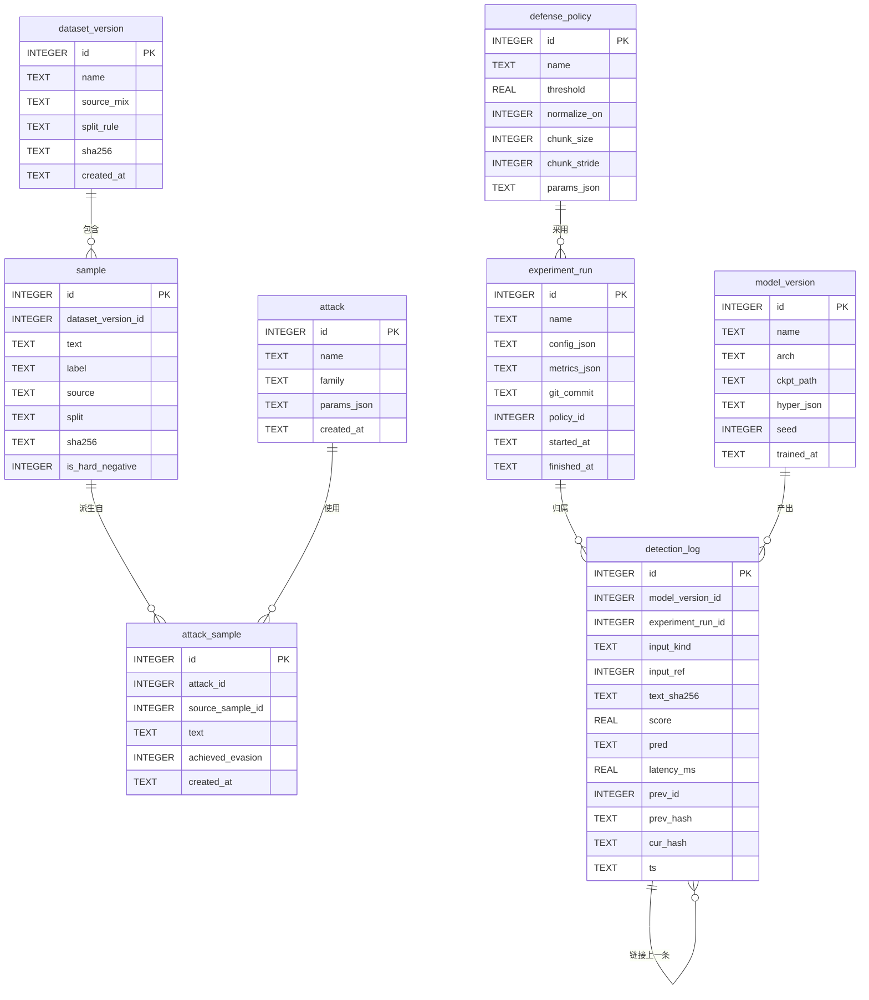

# ER 图（由 injlab/db/schema.sql 自动生成，勿手改）

```mermaid
erDiagram
    sample ||--o{ attack_sample : "派生自"
    attack ||--o{ attack_sample : "使用"
    detection_log ||--o{ detection_log : "链接上一条"
    experiment_run ||--o{ detection_log : "归属"
    model_version ||--o{ detection_log : "产出"
    defense_policy ||--o{ experiment_run : "采用"
    dataset_version ||--o{ sample : "包含"
    attack {
        INTEGER id PK
        TEXT name
        TEXT family
        TEXT params_json
        TEXT created_at
    }
    attack_sample {
        INTEGER id PK
        INTEGER attack_id
        INTEGER source_sample_id
        TEXT text
        INTEGER achieved_evasion
        TEXT created_at
    }
    dataset_version {
        INTEGER id PK
        TEXT name
        TEXT source_mix
        TEXT split_rule
        TEXT sha256
        TEXT created_at
    }
    defense_policy {
        INTEGER id PK
        TEXT name
        REAL threshold
        INTEGER normalize_on
        INTEGER chunk_size
        INTEGER chunk_stride
        TEXT params_json
    }
    detection_log {
        INTEGER id PK
        INTEGER model_version_id
        INTEGER experiment_run_id
        TEXT input_kind
        INTEGER input_ref
        TEXT text_sha256
        REAL score
        TEXT pred
        REAL latency_ms
        INTEGER prev_id
        TEXT prev_hash
        TEXT cur_hash
        TEXT ts
    }
    experiment_run {
        INTEGER id PK
        TEXT name
        TEXT config_json
        TEXT metrics_json
        TEXT git_commit
        INTEGER policy_id
        TEXT started_at
        TEXT finished_at
    }
    model_version {
        INTEGER id PK
        TEXT name
        TEXT arch
        TEXT ckpt_path
        TEXT hyper_json
        INTEGER seed
        TEXT trained_at
    }
    sample {
        INTEGER id PK
        INTEGER dataset_version_id
        TEXT text
        TEXT label
        TEXT source
        TEXT split
        TEXT sha256
        INTEGER is_hard_negative
    }
```
